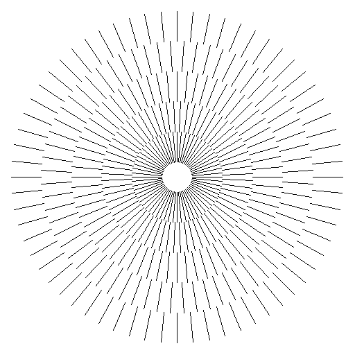
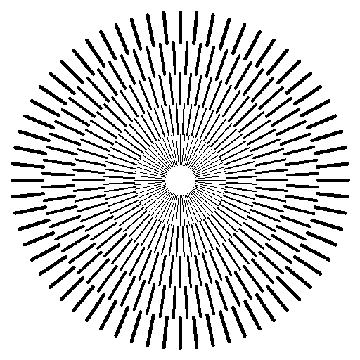
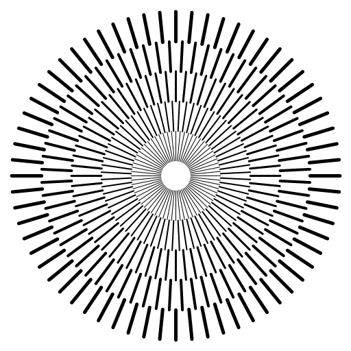
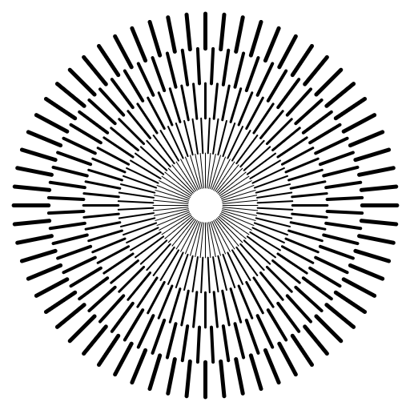
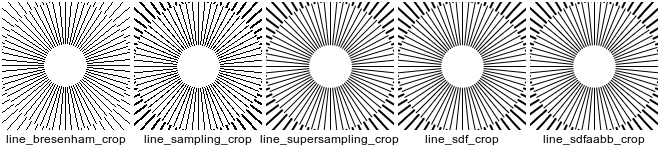

# 2D Line Drawing Samples

This project contains C source code for drawing 2D lines by different techniques.

All samples output PNGs with [svpng](https://github.com/miloyip/svpng).

License: public domain.

## Bresenham

The fundamental line drawing algorithm by Bresenham [1], based on [rosetta code](https://rosettacode.org/wiki/Bitmap/Bresenham%27s_line_algorithm#C).

## Sampling

Represent lines as capsule shapes, in order to support real-valued coordinates and variable width.

## Anti-aliasing by super sampling

Simple anti-aliasing with 5x5 super sampling.

## Anti-aliasing by signed distnace field

Using signed distnace field (SDF) of capsule shape to perform anti-aliasing with single sample per pixel.

## SDF optimization with AABB

Use AABB of capsule to reduce the number of samples. Render shapes into the buffer individually with alpha blending.

## Visual comparison

## Performance comparison

~~~
$ make test
gcc -Wall -O3 -o line_bresenham line_bresenham.c
gcc -Wall -O3 -o line_sampling line_sampling.c
gcc -Wall -O3 -o line_supersampling line_supersampling.c
gcc -Wall -O3 -o line_sdf line_sdf.c
gcc -Wall -O3 -o line_sdfaabb line_sdfaabb.c
time ./line_bresenham
        0.03 real         0.02 user         0.00 sys
time ./line_sampling
        1.93 real         1.91 user         0.00 sys
time ./line_supersampling
       47.06 real        46.85 user         0.10 sys
time ./line_sdf
        2.00 real         1.98 user         0.00 sys
time ./line_sdfaabb
        0.03 real         0.03 user         0.00 sys
~~~

## Final notes

1. These samples are only for illustrative purposes.
2. Line clipping are not performed.
3. The SDF AABB sample can be further optimized by tigther quaduraliteral bounds.

## References

[1] Bresenham, Jack E. "Algorithm for computer control of a digital plotter." IBM Systems journal 4.1 (1965): 25-30.
